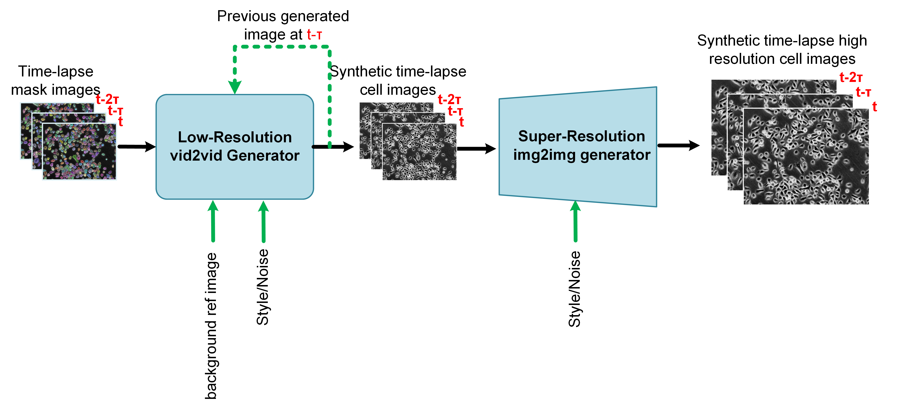

# tGAN

This repository hosts the training and evaluation code for "tGAN: Enhanced Cell Tracking Using A GAN-based Super-Resolution Video-to-Video Time-Lapse Microscopy Generative Model." This model is designed to significantly enhance the quality and diversity of synthetic annotated time-lapse microscopy data. Our model features a dual-resolution architecture that adeptly synthesizes both low and high-resolution images, uniquely capturing the intricate dynamics of cellular processes essential for accurate tracking. 

### Datasets
We employed two annotated time-lapse microscopy datasets in our experiments, including DeepSea and Cell Tracking Challenge samples. Access the datasets here: [tGAN_datasets](https://drive.google.com/drive/folders/1t-5bP0dudbwrtWCj1Pe4UCLxFgovFdOJ?usp=sharing)

### Requirements

* Optional: Create a conda or Python virtual environment.

* Install the required packages using:
```
pip install -r requirements.txt
```

### Usage
#### Training the Low-Resolution Video-to-Video and Super-Resolution Image-to-Image Models
Train the model with your own dataset or use our provided tGAN dataset. During training, the script logs the training process and also saves the models' checkpoints to the specified output_dir. 
```
Example:

python train_low_res_vid2vid.py --train_set_dir  .../tGAN_datasets/DeepSea_datasets/mouse_embryonic_stem_cell_dataset/train/  --lr 0.0001 --p_vanilla 0.2 --p_diff 0.2 --output_dir tmp/

python train_sup_res_vid2vid.py --train_set_dir  .../tGAN_datasets/DeepSea_datasets/mouse_embryonic_stem_cell_dataset/train/  --lr 0.0001 --p_vanilla 0.2 --p_diff 0.2 --output_dir tmp/
```

#### Testing the End-to-End Model
Evaluate end2end model using our tGAN dataset or yours, specifying the super-resolution and low-resolution checkpoint directories. You can download some tGAN checkpoints for testing from this [tGAN_checkpoints](https://drive.google.com/drive/folders/1vnsV2EJPeq2b-PjLDaGFr7TQQywOwdXG?usp=sharing) link. This script calculates and returns video quality metrics for the test set, including FVD, SSIM, PSNR, and LPIPS. Additionally, it saves the generated low-resolution and super-resolution video frames alongside the groundtruth frames to the specified output_dir.
```
Example:
python test_end2end.py --test_set_dir .../tGAN_datasets/DeepSea_datasets/mouse_embryonic_stem_cell_dataset/test/ --low_res_gen_ckpt_dir .../tGAN_checkpoints/low_resolution_models/mouse_embryonic_stem_cell_ckpt/ --sup_res_gen_ckpt_dir .../tGAN_checkpoints/super_resolution_models/mouse_embryonic_stem_cell_ckpt/ --output_dir tmp/
```

### Useful Information
If you have any questions, contact us at abzargar@ucsc.edu.


